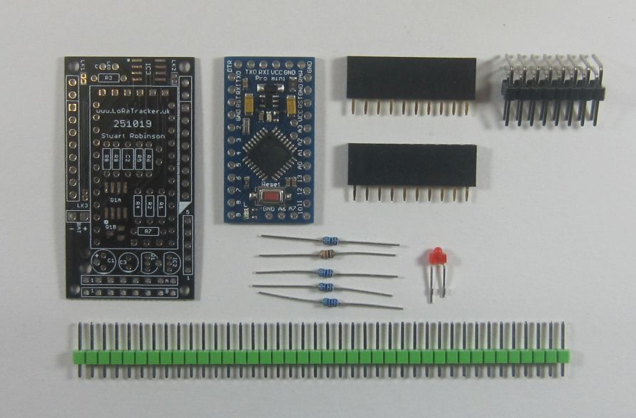
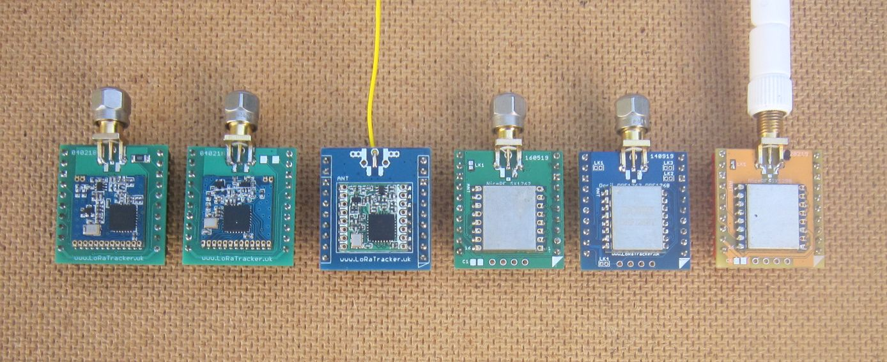
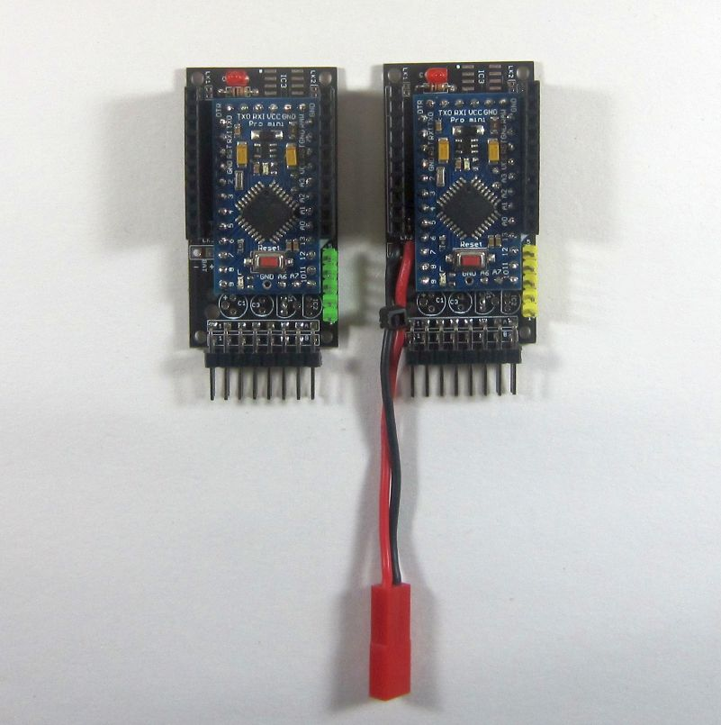
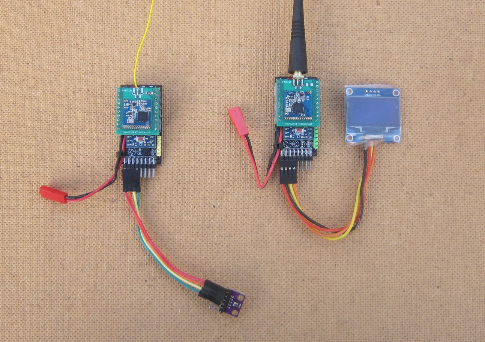
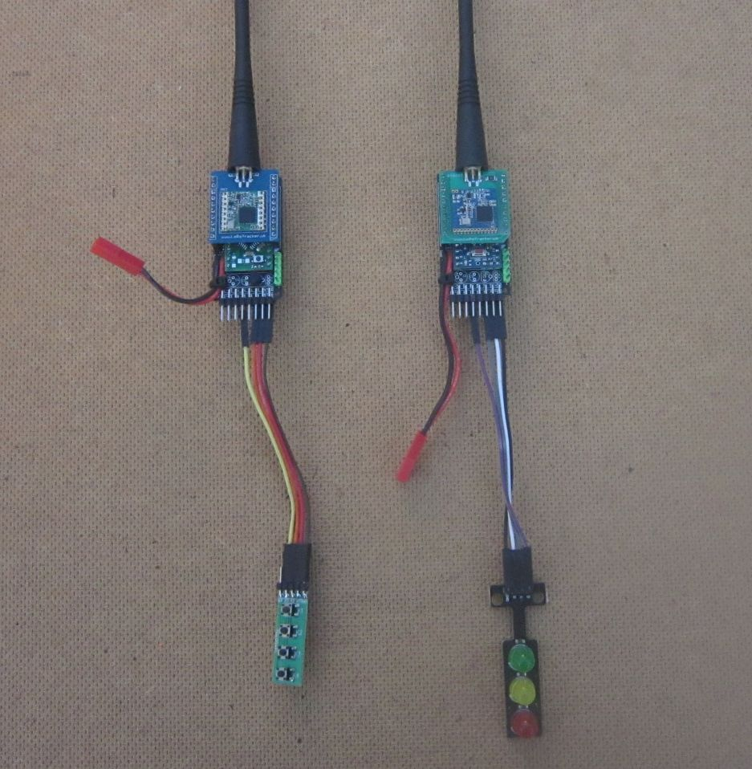
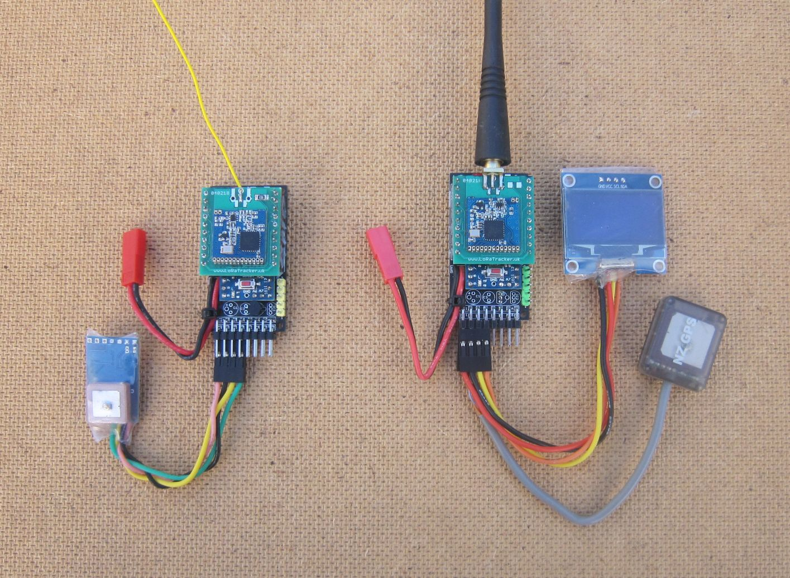
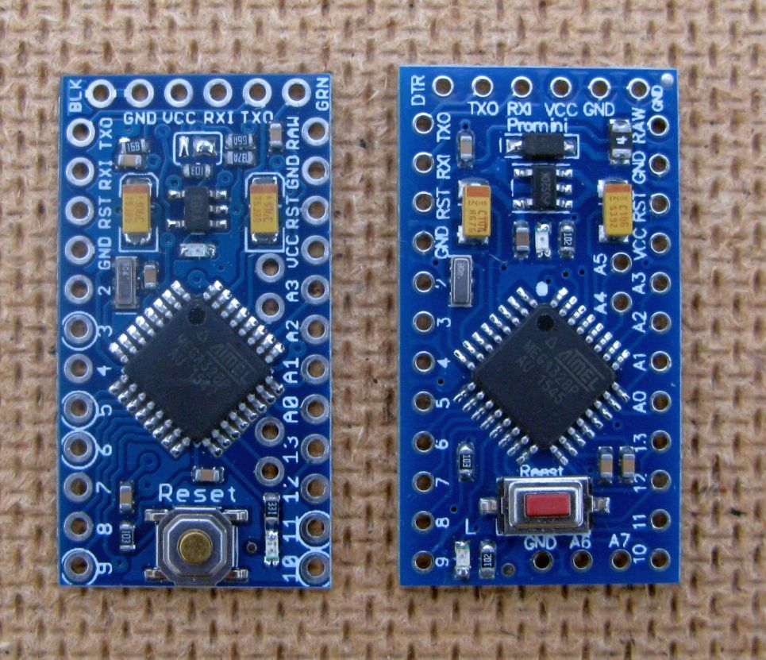

# Evaluation Board

To test the example programs in the SX12XX library I developed a small Pro Mini based board that could be used for general purpose LoRa based sensor and tracking applications. The ‘Easy Mikrobus Pro Mini’ board uses a minimum number of parts and can be easily built in its basic form, using just a few standard wired components and pin headers. 
The board takes a single Mikrobus compatible plug in board in addition to plug in boards that  LoRaTracker produce which extend the pin out to 10 pins either side, this is a great help when using LoRa modules. The parts needed for a basic build ‘Easy Mikrobus Pro Mini’ are shown below;

 

The base boards can be used for most of the current LoRa modules just by plugging the appropriate on in, shown below (left to right) are plug in modules for SX1276 (Dorji), SX1272 (Dorji), RFM98 (Hope), SX1262 (NiceRF), SX12768 (Dorji) and SX1280 (NiceRF). 

 

 

When assembled the boards looks like this;

 

There are 10 way 0.1” header sockets on the long edge and 2 x 8 way connectors on the bottom edge. The Pro Mini used is an 3.3V 8Mhz commonly advertised at low cost on sites such as eBay. These Pro Minis have on the RAW pin power input a reverse protection diode and a fuse. 

One of the example program is an application that reads a BME280 sensor and transmits the values to a remote receiver which shows the sensor values on an OLED display. The two boards used the test the sensor application are shown below, with the LoRa modules plugged in;

 

 

Another of the example programs is a demonstration of remote control basics, switching traffic light LEDs on and off via a LoRa link. On a 'bare bones' Arduino set-up the transmitter has a sleep current of approx 2.2uA, so it's ideal for a battery powered remote control with a potential range of many kilometres.

 
 

 

One of the other example programs is a GPS tracker, this reads a GPS and uses LoRa to transmit the location of the tracker to a remote receiver, the receiver shown (program to be released soon) has its own GPS and is able to calculate the distance to and direction of the remote transmitter see below;

 

 

The GPS tracker transmitter and receiver are quite small and suitable for portable operations such a trackers for ‘lost’ radio controlled models and similar. The advantage of using the Mikrobus modules is that its easy to change the board between the range of LoRa modules and makes testing easier too. 

Its true that you could make smaller boards for trackers and similar, but this inevitably involves using surface mount component which results in far more complex assembly. The Easy Mikrobus Pro Mini board needs only minimal soldering skills to assemble, its very low cost too.
 
The  Easy Mikrobus Pro Mini board can be fitted with additional surface mount components that can;

Turn off the power to connected devices

Provide non-Volatile FRAM storage

Turn off the resistor divider that measures battery voltage to save power

Add a DS18B20 temperature sensor.

However,  do appreciate that the example programs should be usable with other Arduinos, you don't need to use the boards shown above, also remember that the LoRa modules are 3.3V logic devices, so do not connect directly to 5V Arduinos, some form of logic level conversion is needed. 

### Assembly

It is not my intention to provide a fully annotated set of build instructions for this board, there is in any case very little building to do. However, it does need to be assembled in a particular order as some of the components are mounted under the Pro Mini. So assemble in this order;

1. First make sure you have the right layout of Arduino Pro Mini and be sure its a 3.3V 8Mhz version. There are currently two common layouts of Pro Minis to be found on sites such as eBay. The one on the left in the picture below used to be the most common, but today the one on the right is seen most often. Its the one on the right that is needed, it has a fuse and reverse protection diode fitted, so these do not need to be added externally. Note the order of the programming pins on the top of this pro Mini, left to right, DTR, TXD, RXD, VCC, GND. If this is not the order on your Pro Mini, it wont work with the board. Also note that with this Pro Mini, A6 and A7 pins are on the bottom of the board next to pin 10.

2. On the board fit C2,R1,R2,R3,R5,R6 and the LED. Be sure to solder components in place so that they are close to the surface of the PCB, they have to fit in the gap under the Pro Mini. Check that the rounded side of the LED points to the left, away from IC3. 
3. There is an option of fitting a high side MOSFET switch to turn off components connected to the pin headers at the bottom of the board. You may for instance want to turn off a connected GPS or I2C sensor. There are two options for the MOSFET, an SI4459ADY in a 8 pin SOIC package or a IRLML6402 MOSFET in a SOT23 package. I recommend the IRLML6402 option so to use device power switching add Q1B, R8, R9 and C3. 
4. Pin 7 of CONB is notionally called SWITCH1, but can be re-purposed to fit a DS18B20 temperature sensor in location IC2. If you want to fit this sensor, fit R4 now. 
5. Prepare these 0.1" pin headers, 2 x 12way, 1 x 6 way, 2 x 2way. Place these pin headers in the holes where the Pro Mini will be fitted, don't miss the 2 way pin headers for A4, A5 (just right of R6) and A6,A7 (just above Q1). Don't solder the pins in place. 
6. Fit  the Pro Mini over the pins and hold in place with an elastic band so the Pro Mini is held tight against the PCB whilst the pins are soldered in place on both sides. 
7. The Program header (5 way 0.1" pin header) needs to be soldered in place, its just to the right of IC2. It can be fitted vertically, as shown in the pictures, or an angled one can be fitted to the underside of the PCB. 
8. A standard USB serial adapter can now be connected to the program header and will normally supply enough power to run simple test programs. Load the **1\_LED\_Blink** program and check that the LED flashes at once per second. 
9. You can power the board externally either via the pins on the expansion connector or solder a JST lead into the two holes marked 'BAT' on the PCB. Use the large hole by C1 to secure the lead in place. 
10. Check that the LED program still runs when used with an external battery. I would suggest a battery of no higher voltage than 4 x AA Alkaline batteries.
11. Q1 is used to turn off the voltage divider used to measure the battery voltage, so solder it in place and load the program **45\_Battery\_Voltage\_Read\_Test** to check that the reported voltage matches the external battery voltage, you may need to adjust the 'ADMultiplier' value in the 'Settings.h' file to have the correct value reported. 
12. Fit the 2 row 8 way angled 0.1" pin header to the bottom of the PCB, and the two 10 way 0.1" sockets on the edges of the PCB. These sockets are used to plug in the various LoRa modules. 
13. If you know a plug in module is working OK, you can omit the 10 way sockets direct to the board for a lower profile project. When soldering the LoRa modules in place like this, use a bit of card as a spacer between the bottom of the LoRa module and Pro Mini to ensure there are no shorts.       

 
### Stuart Robinson

### December 2019

